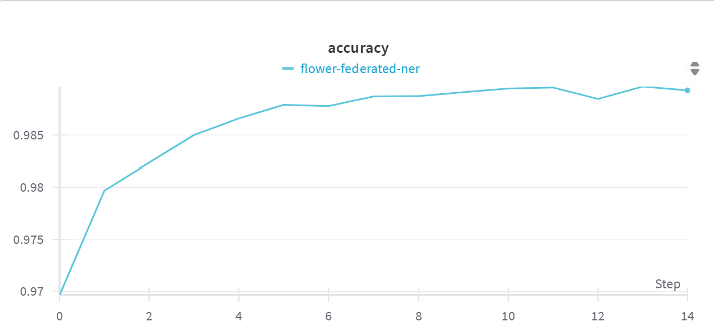
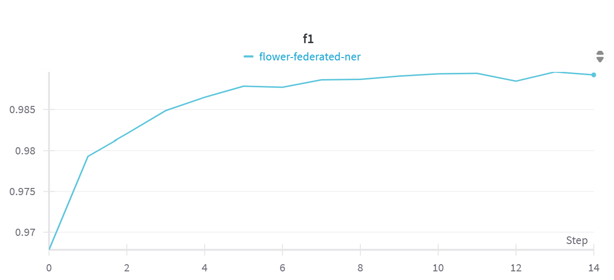
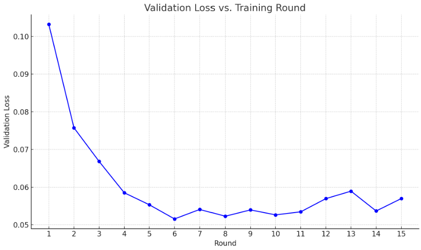

# FEDNER -> A Basic Federated Learning Pipeline Using FedAvg on a NER task to Simulate Decentralized Training
Implementation of a basic federated learning pipeline using FedAvg on a lightweight NLP task to simulate decentralized training and understand communication and convergence dynamics. 

## Instructions for Setup
--- This is to be filled out ---- (with Environment Requirements and Steps section)

## Files
\fed-ner  
|--- __init_.py  
|--- client_app.py  
|--- server_app.py  
|--- task.py 
|--- EVALUATOIN.md 
|--- Requirements.txt 
|--- pyproject.toml 

## Our Evaluation Metrics
### Details
- FlowerAi to simulate the environment
- Huggingface's distilbert-case-based model
-  CoNLL-2003 dataset
- 10 clients trained locally on its data for 2 epochs, then sent model weights to the server. 
- 15 rounds

### Chart
| round | accuracy   | f1          | communication_cost_bytes | validation_loss       |
|-------|------------|-------------|---------------------------|------------------------|
| 1     | 0.95404562 | 0.94963364  | 2608043880                | 0.10319166073782575    |
| 2     | 0.97130177 | 0.96980839  | 2608043880                | 0.07574635714602966    |
| 3     | 0.97727415 | 0.97668640  | 2608043880                | 0.06682067823971415    |
| 1     | 0.97054035 | 0.96892876  | 2608043880                | 0.10319166073782575    |
| 2     | 0.98012391 | 0.97978104  | 2608043880                | 0.07574635714602966    |
| 1     | 0.96964247 | 0.96784104  | 2608043880                | 0.10319166073782575    |
| 2     | 0.97968778 | 0.97929435  | 2608043880                | 0.07574635714602966    |
| 3     | 0.98236403 | 0.98203367  | 2608043880                | 0.06682067823971415    |
| 4     | 0.98499803 | 0.98485805  | 2608043880                | 0.058508654318898665   |
| 5     | 0.98659731 | 0.98649236  | 2608043880                | 0.055311147029472825   |
| 6     | 0.98790287 | 0.98784801  | 2608043880                | 0.051560005200816605   |
| 7     | 0.98778088 | 0.98772592  | 2608043880                | 0.054076913765554      |
| 8     | 0.98870909 | 0.98863831  | 2608043880                | 0.0522738703961497     |
| 9     | 0.98873998 | 0.98869271  | 2608043880                | 0.05395799820176358    |
| 10    | 0.98911871 | 0.98908974  | 2608043880                | 0.05263798198324771    |
| 11    | 0.98946823 | 0.98936641  | 2608043880                | 0.05345106031581963    |
| 12    | 0.98955986 | 0.98943091  | 2608043880                | 0.05695142367446048    |
| 13    | 0.98847258 | 0.98846983  | 2608043880                | 0.05892543361042044    |
| 14    | 0.98965997 | 0.98960470  | 2608043880                | 0.053668949269558654   |
| 15    | 0.98929647 | 0.98923969  | 2608043880                | 0.056967484186609206   |

## Plots
Run finished 15 round(s) in 5150.24s.
### Accuracy v. Steps
<!--  -->
 
From this plot we can see the following: (1) Upward Accuracy Trend (Convergence)-> The plot shows a consistent increase in accuracy, especially in the early steps, indicating that the model is converging well during training. (2) Plateauing Behavior (Stability)- Around step 6–7, the accuracy curve begins to flatten, suggesting that the model is reaching optimal performance and training is stabilizing. (3) Noise and Fluctuation (Communication Variability) -> Minor fluctuations in later steps (e.g., steps 11–13) are expected in federated learning due to client variability and are within acceptable bounds. (4) High Final Accuracy (Model Quality) -> The final accuracy reaches approximately 0.988, indicating effective learning and strong model performance on the task. (5) Smoothness of the Curve (Synchronization Quality) -> The overall smooth curve suggests good synchronization and effective aggregation in the FedAvg process, with no signs of divergence or instability.

### F1 v. Steps
<!--  -->
 
From this plot we can see the following: (1) Strong Upward Trend (Effective Learning) The F1 score increases quickly in the first few steps, indicating that the model is effectively learning both precision and recall early in training. (2) Smooth Convergence (Stable Optimization) -> The curve becomes smoother and begins to plateau around steps 6–8, showing stable convergence and reliable performance across rounds. (3) High Final F1 Score (Balanced Performance) -> The final F1 score reaches approximately 0.988, reflecting a strong balance between precision and recall—critical for Named Entity Recognition (NER) tasks. (4) Minimal Variability (Low Client Drift) -> The minor fluctuations in later rounds are small, suggesting that the FedAvg aggregation effectively handles client variability with low drift. (5) No Overfitting Signs (Generalization) -> The consistently high and stable F1 score across steps implies that the model generalizes well across the decentralized dataset without overfitting.

### Validation Loss v. Round
<!--  -->
 
(1) Converging Validation Loss: The validation loss steadily decreases over training rounds, showing that the federated model improves its generalization on unseen data as more communication rounds complete. (2) Non-Monotonic Descent -> The validation loss doesn’t decrease smoothly, there are small fluctuations or bumps, likely due to variability in local client updates, data heterogeneity, or limited local training epochs causing noisy gradients aggregated via FedAvg. (3) Indicative of Client Data Heterogeneity -> The irregular pattern hints at non-i.i.d. data distributions among clients, a common challenge in federated learning, which can slow convergence and create instability in the global model’s performance. (4) Sufficient Communication Rounds -> The downward trend suggests that the number of training rounds and communication cycles is adequate to achieve convergence, but the curve’s shape indicates that more rounds or tuning could further smooth the loss decrease. (5) Potential for Optimization -> The curve suggests opportunities to optimize the federated pipeline, for example, adjusting client sampling, local epochs, or learning rates—to reduce fluctuations and improve the speed and stability of convergence.

